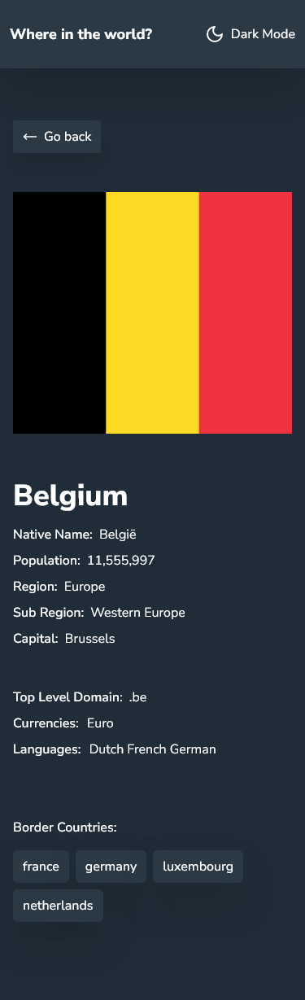

# Frontend Mentor - REST Countries API with color theme switcher solution

This is a solution to the [REST Countries API with color theme switcher challenge on Frontend Mentor](https://www.frontendmentor.io/challenges/rest-countries-api-with-color-theme-switcher-5cacc469fec04111f7b848ca). Frontend Mentor challenges help you improve your coding skills by building realistic projects.

## Table of contents

- [Overview](#overview)
  - [The challenge](#the-challenge)
  - [Screenshot](#screenshot)
  - [Links](#links)
- [My process](#my-process)
  - [Built with](#built-with)
  - [What I learned](#what-i-learned)
- [Author](#author)

## Overview

### The challenge

Users should be able to:

- See all countries from the API on the homepage
- Search for a country using an `input` field
- Filter countries by region
- Click on a country to see more detailed information on a separate page
- Click through to the border countries on the detail page
- Toggle the color scheme between light and dark mode _(optional)_

### Screenshot





### Links

- Solution URL: [REST Countries API with color theme switcher (GITHUB)](https://github.com/abdul-haseeb123/rest-countries-api-color-theme-switcher)
- Live Site URL: [REST Countries API with color theme switcher (NETLIFY)](https://benevolent-pony-af4d2b.netlify.app/)

## My process

### Built with

- Semantic HTML5 markup
- Flexbox
- Mobile-first workflow
- [React](https://reactjs.org/) - JS library
- [Next.js](https://nextjs.org/) - React framework
- [Tailwind CSS](https://tailwindcss.com/) - For styles
- [Radix UI](https://www.radix-ui.com/) - For Select Dropdown
- [Shadcn UI](https://ui.shadcn.com/) - For Select Dropdown
- [Lucide React](https://lucide.dev/) - For Icons
- [Use Debounce](https://github.com/xnimorz/use-debounce/) - For Debounce Search

### What I learned

I learned how to add and customize a select dropdown using Radix UI and Shadcn UI. I also learned how to use the useDebounce hook to debounce the search input.

```js
const router = useRouter();
const [name, setName] = useState("");
const [region, setRegion] = useState("");
const [query] = useDebounce(name, 500);

useEffect(() => {
  if (!query && region == "") {
    router.push("/");
  } else {
    if (region == "") {
      router.push(`/?name=${query}`);
    } else if (query == "") {
      router.push(`/?region=${region}`);
    } else {
      router.push(`/?name=${query}&region=${region}`);
    }
  }
}, [query, region, router]);
```

```js
function SelectRegion({
  value,
  onValueChange,
}: {
  value: string,
  onValueChange: (value: string) => void,
}) {
  return (
    <Select value={value} onValueChange={(value) => onValueChange(value)}>
      <SelectTrigger className="w-56 bg-white dark:bg-[hsl(209,23%,22%)] border-0 focus:ring-offset-0 shadow-lg focus:ring-0 px-5 py-6 dark:data-[placeholder]:font-semibold font-semibold ">
        <SelectValue placeholder="Filter by Region" />
      </SelectTrigger>
      <SelectContent className="bg-white dark:bg-[hsl(209,23%,22%)]">
        <SelectGroup>
          <SelectItem
            value="africa"
            className="data-[highlighted]:bg-background font-medium"
          >
            Africa
          </SelectItem>
          <SelectItem
            value="americas"
            className="data-[highlighted]:bg-background font-medium"
          >
            Americas
          </SelectItem>
          <SelectItem
            value="asia"
            className="data-[highlighted]:bg-background font-medium"
          >
            Asia
          </SelectItem>
          <SelectItem
            value="europe"
            className="data-[highlighted]:bg-background font-medium"
          >
            Europe
          </SelectItem>
          <SelectItem
            value="oceania"
            className="data-[highlighted]:bg-background font-medium"
          >
            Oceania
          </SelectItem>
          <SelectItem
            value="polar"
            className="data-[highlighted]:bg-background font-medium"
          >
            Polar
          </SelectItem>
        </SelectGroup>
      </SelectContent>
    </Select>
  );
}
```

## Author

- Frontend Mentor - [@abdul-haseeb123](https://www.frontendmentor.io/profile/abdul-haseeb123)
- LinkedIn - [@ashaseeb](https://www.linkedin.com/in/ashaseeb/)
